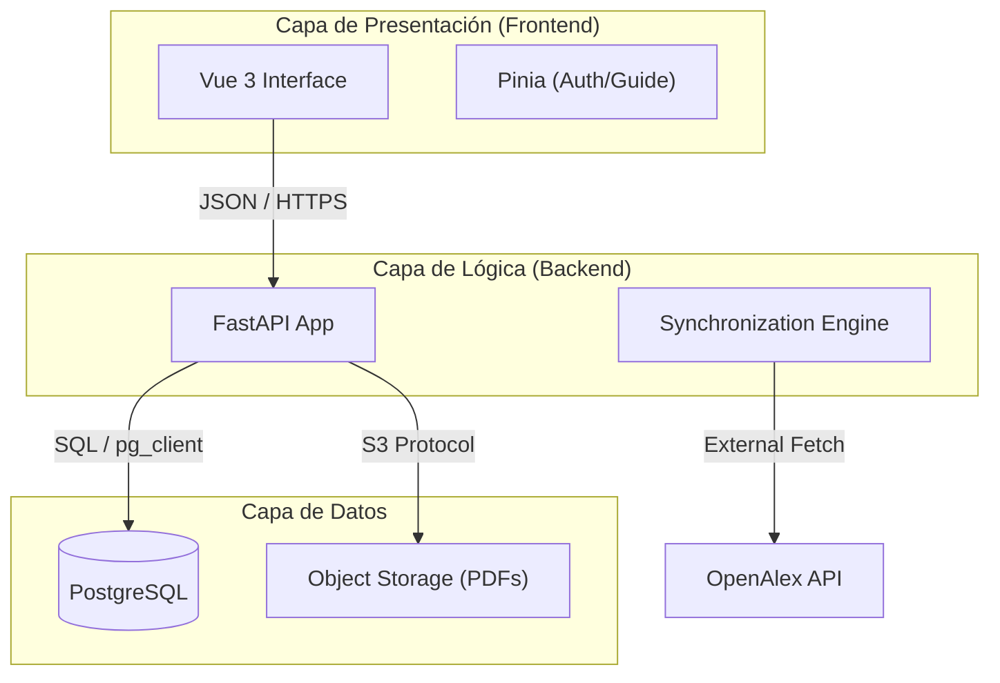

# Arquitectura del Sistema — CECAN Platform

## Visión General
La plataforma CECAN está diseñada bajo una arquitectura moderna de **Monorepo Desacoplado**, priorizando la escalabilidad, la mantenibilidad y la integridad de los datos científicos.

### Stack Tecnológico
- **Frontend:** [Vue 3](https://vuejs.org/) (Composition API) + [Vite](https://vitejs.org/) + [Tailwind CSS](https://tailwindcss.com/).
- **Backend:** [FastAPI](https://fastapi.tiangolo.com/) (Python 3.11+).
- **Base de Datos:** [PostgreSQL](https://www.postgresql.org/) hospedado en [Supabase](https://supabase.com/).
- **Persistencia de Archivos:** Supabase Storage (S3-compatible).
- **Autenticación:** Supabase Auth (JWT).
- **Despliegue:** [Vercel](https://vercel.com/) (Integración continua CI/CD).

---

## Diagrama de Caja Blanca (Sistema)
El sistema se divide en tres capas fundamentales: Cliente, API de Servicios y Capa de Persistencia.

---

## Decisiones de Diseño (ADRs)
1. **Serverless Architecture:** Se optó por FastAPI + Vercel para garantizar un escalado automático sin administración de servidores (Zero Ops).
2. **SSO ready:** El uso de Supabase Auth permite una integración futura simplificada con sistemas de autenticación universitaria.
3. **Métrica JCR Nativa:** El sistema no depende únicamente de APIs externas para los cuartiles; posee un repositorio local sincronizado para garantizar la inmutabilidad de los reportes históricos.
