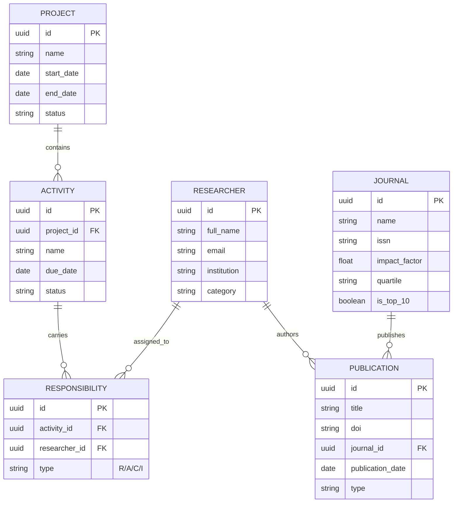

# Modelo de Datos — CECAN Platform

## Diagrama Entidad-Relación (ERD)
La base de datos utiliza un modelo relacional en PostgreSQL para gestionar la complejidad de la producción científica y la planificación de proyectos.

---

## Tablas Principales

### 1. `researchers`
Almacena el capital humano del centro, segmentado por categorías (Principal, Asociado, Adjunto, Estudiante).

### 2. `publications`
Represidat de la producción científica. Relaciona títulos y DOIs con sus respectivas métricas editoriales.

### 3. `journals`
Maestro de revistas científicas con snapshots anuales de métricas JCR (Journal Citation Reports).

### 4. Gestión de Actividades y Responsabilidades
Tabla vincular que permite definir roles (`Responsible`, `Accountable`, `Consulted`, `Informed`) en actividades específicas del proyecto para una futura automatización de notificaciones.
