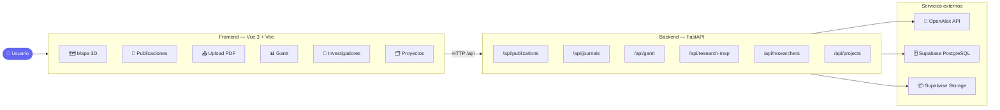

# CECAN Platform — Documentación Técnica

> Plataforma de gestión de investigación científica para el Centro CECAN. Monorepo con FastAPI backend y Vue 3 frontend, desplegado en Vercel con Supabase PostgreSQL.

---

## Índice

| Documento | Descripción |
|-----------|-------------|
| [Arquitectura](./arquitectura.md) | Stack, estructura del proyecto, diagramas del sistema |
| [Base de Datos](./base-de-datos.md) | Modelos, esquemas ER, relaciones |
| [API Reference](./api.md) | Todos los endpoints, parámetros, respuestas |
| [Frontend](./frontend.md) | Vistas, componentes, stores, router |
| [Flujos principales](./flujos.md) | Upload PDF, Gantt, Mapa 3D, RACI |
| [Despliegue](./deployment.md) | Vercel, variables de entorno, CI/CD |

---

## Vista rápida del sistema



---

## Inicio rápido

### Prerrequisitos

- Python 3.11+
- Node.js 18+
- Cuenta Supabase (BD + Storage configurados)

### Backend

```bash
cd backend
python -m venv .venv && source .venv/bin/activate
pip install -r requirements.txt
cp .env.example .env          # completar variables
python -m uvicorn main:app --reload --port 8000
```

### Frontend

```bash
cd frontend
npm install
cp .env.example .env.local    # VITE_API_URL=http://localhost:8000/api
npm run dev
```

### Ambos (desde raíz)

```bash
make dev
```

### Verificar que funciona

```bash
curl http://localhost:8000/health
# → {"status": "ok", "version": "1.0.0"}
```

---

## Variables de entorno

### Backend (`backend/.env`)

| Variable | Descripción | Requerida |
|----------|-------------|-----------|
| `DATABASE_URL` | PostgreSQL Supabase connection string | ✅ |
| `SUPABASE_URL` | `https://xxx.supabase.co` | ✅ |
| `SUPABASE_KEY` | Service role key | ✅ |
| `SECRET_KEY` | JWT signing secret | ✅ |
| `ALGORITHM` | JWT algorithm (`HS256`) | ✅ |
| `ACCESS_TOKEN_EXPIRE_MINUTES` | Duración sesión JWT | ✅ |
| `ALLOWED_ORIGINS` | CORS origins separados por coma | ✅ |
| `GOOGLE_API_KEY` | Gemini AI (opcional) | ⬜ |

### Frontend (`frontend/.env.local`)

| Variable | Descripción |
|----------|-------------|
| `VITE_API_URL` | URL base de la API (ej: `https://cecan.vercel.app/api`) |

---

## Casos de uso principales

1. **Subir un PDF** → `/upload` o drag & drop en `/publications`
2. **Ingresar DOI manual** → cuando el PDF no tiene DOI embebido
3. **Ver métricas JCR** → tabla en `/publications` con cuartil, IF, Top 10%
4. **Planificar proyecto** → `/gantt` con vista por proyecto o global
5. **Explorar colaboraciones** → Mapa 3D en `/` y grafo en `/collaboration-map`
6. **Mis tareas RACI** → `/my-tasks` con actividades asignadas
