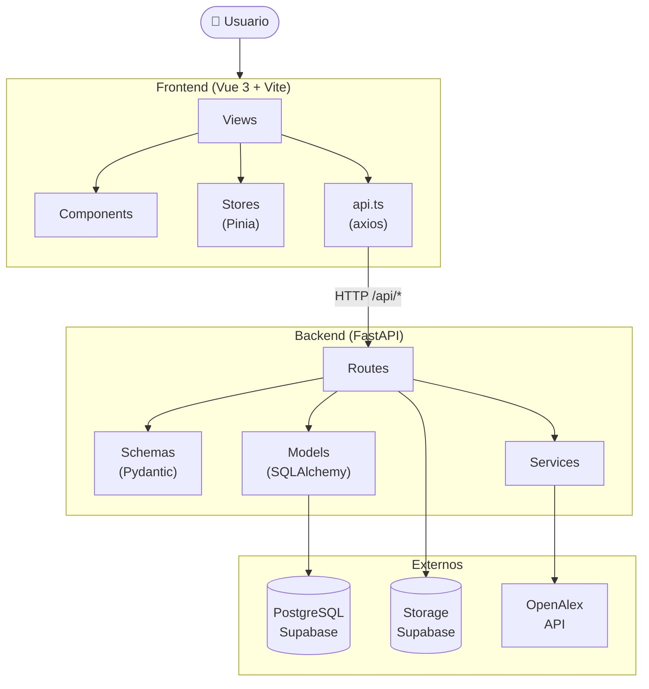
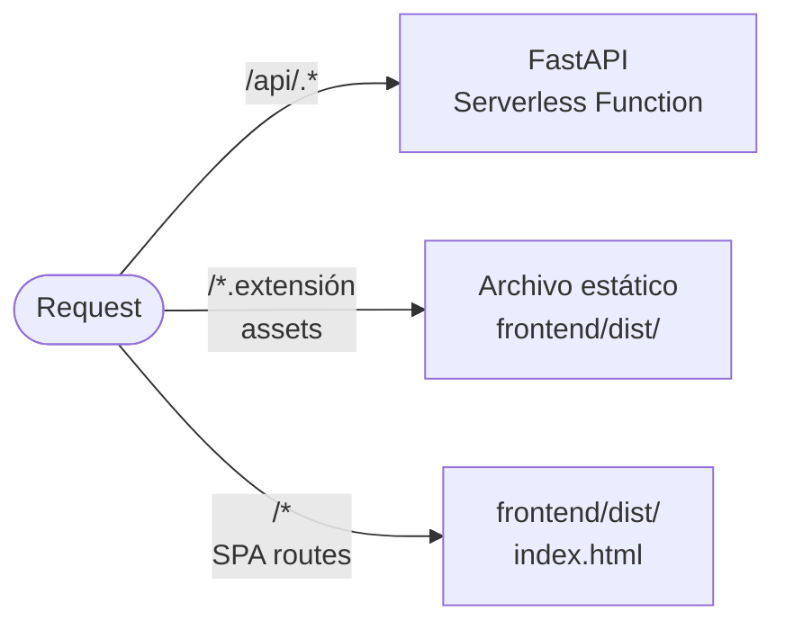

# Arquitectura del Sistema

## Stack tecnológico

| Capa | Tecnología | Versión |
|------|-----------|---------|
| **Frontend** | Vue 3 + Vite | Vue 3.5 / Vite 7 |
| **Lenguaje FE** | TypeScript | 5.x |
| **Estilos** | Tailwind CSS | 4.x |
| **Estado global** | Pinia | 2.x |
| **3D** | Three.js + OrbitControls | — |
| **Gantt** | DHTMLX Gantt | — |
| **Grafo** | vis-network / 3d-force-graph | — |
| **Iconos** | lucide-vue-next | — |
| **Backend** | FastAPI | 0.110+ |
| **Lenguaje BE** | Python | 3.11+ |
| **ORM** | SQLAlchemy | 2.0 |
| **Validación** | Pydantic | v2 |
| **Migraciones** | Alembic | — |
| **Base de datos** | PostgreSQL (Supabase) | 15 |
| **Storage** | Supabase Storage | — |
| **Hosting** | Vercel | — |
| **API externa** | OpenAlex | — |

---

## Estructura del monorepo

```
cecan_vercel/
├── backend/
│   ├── api/routes/               # Endpoints REST por dominio
│   │   ├── publications.py       # Upload + gestión de publicaciones
│   │   ├── journals.py           # Búsqueda de revistas JCR
│   │   ├── researchers.py        # Investigadores y miembros
│   │   ├── students.py           # Estudiantes y tesistas
│   │   ├── projects.py           # Proyectos científicos
│   │   ├── project_activities.py # Actividades para el Gantt
│   │   ├── responsibilities.py   # Asignaciones RACI + My Tasks
│   │   ├── gantt.py              # Integración DHTMLX (tasks + links)
│   │   ├── research_map.py       # Mapa 3D de publicaciones
│   │   └── graph.py              # Grafo de colaboración vis-network
│   ├── core/
│   │   ├── models.py             # Modelos SQLAlchemy
│   │   ├── schemas.py            # Schemas Pydantic (request/response)
│   │   └── config.py             # Settings desde variables de entorno
│   ├── database/
│   │   └── session.py            # Engine + get_db dependency
│   ├── services/
│   │   ├── doi_extractor.py      # Extrae DOI desde bytes PDF
│   │   ├── openalex_service.py   # Cliente async OpenAlex API
│   │   └── journal_service.py    # Búsqueda JCR + cálculo de métricas
│   └── main.py                   # FastAPI app, CORS, routers
│
├── frontend/src/
│   ├── views/                    # Páginas (nivel router)
│   ├── components/               # Componentes reutilizables
│   │   ├── layout/               # Sidebar, AppShell
│   │   ├── ui/                   # GuideLabel, AppTooltip
│   │   ├── publications/         # ManualDoiModal
│   │   └── projects/             # DHMLXGantt, ActivityStatusModal
│   ├── stores/                   # Pinia stores
│   ├── services/api.ts           # Cliente axios centralizado
│   ├── types/publication.ts      # Tipos TypeScript compartidos
│   └── router/index.ts           # Vue Router (SPA)
│
├── scripts/                      # Seed, migraciones, import JCR
├── docs/                         # Esta documentación
├── vercel.json                   # Configuración despliegue Vercel
└── Makefile                      # Comandos de desarrollo
```

---

## Diagrama de capas



---

## Routing en Vercel



**`vercel.json` resumido:**

```json
{
  "routes": [
    { "src": "/api/(.*)",               "dest": "backend/main.py"     },
    { "src": "^/(.+\\.[a-zA-Z0-9]+)$", "dest": "frontend/$1"         },
    { "src": "/(.*)",                   "dest": "frontend/index.html"  }
  ]
}
```

---

## Patrones de diseño aplicados

| Patrón | Dónde | Beneficio |
|--------|-------|-----------|
| **Service Layer** | `services/` backend | Lógica de negocio separada de los routers |
| **Repository** | `journal_service.py` | Encapsula búsquedas JCR; intercambiable |
| **Schema Validation** | Pydantic schemas | Validación automática de entradas y salidas |
| **Composition API** | Todos los Vue SFCs | Lógica reutilizable con `<script setup lang="ts">` |
| **Dependency Injection** | `Depends(get_db)` | Sesiones BD gestionadas por FastAPI |
| **Snapshot pattern** | Campos `*_snapshot` en Publication | Preserva métricas al momento del upload |
| **Teleport pattern** | `GuideLabel.vue` | Labels renderizadas en `<body>` para z-index global |

---

## Decisiones técnicas clave

### NullPool (sin pool de conexiones)

```python
engine = create_engine(DATABASE_URL, poolclass=NullPool)
```

Vercel destruye el proceso entre invocaciones. `NullPool` evita conexiones colgadas.

### Snapshot de métricas JCR

`impact_factor_snapshot`, `quartile_snapshot` y `jif_percentile_snapshot` se guardan en la publicación al momento del upload. Esto garantiza reproducibilidad histórica aunque el dataset JCR se actualice en el futuro.

### DOI como pivote central

El DOI es el identificador que conecta todo el flujo: extracción PDF → OpenAlex → ISSN → JCR. Sin DOI, la publicación queda en estado `uploaded` hasta que el usuario lo ingrese manualmente.

### Meses relativos en actividades Gantt

Las actividades de proyectos usan `start_month` y `end_month` (enteros relativos al inicio del proyecto), no fechas absolutas. Esto permite que mover las fechas del proyecto ajuste automáticamente todas sus actividades.
