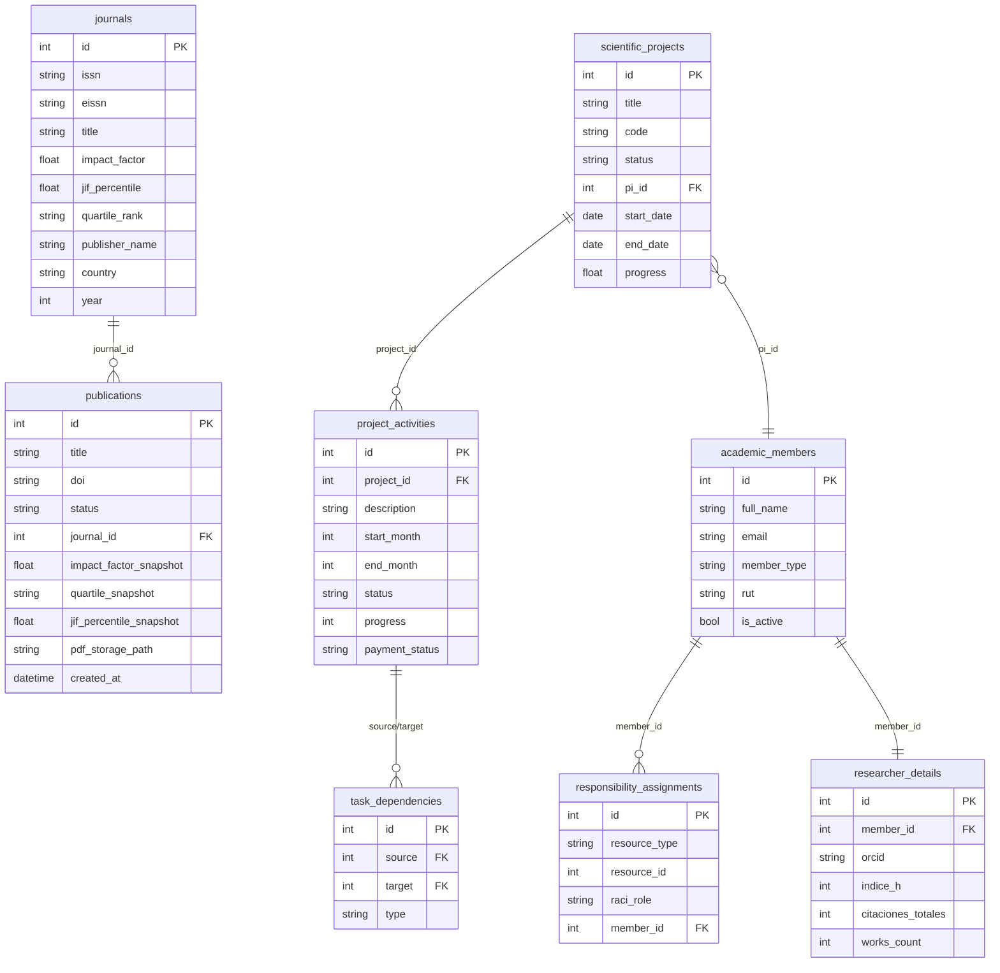
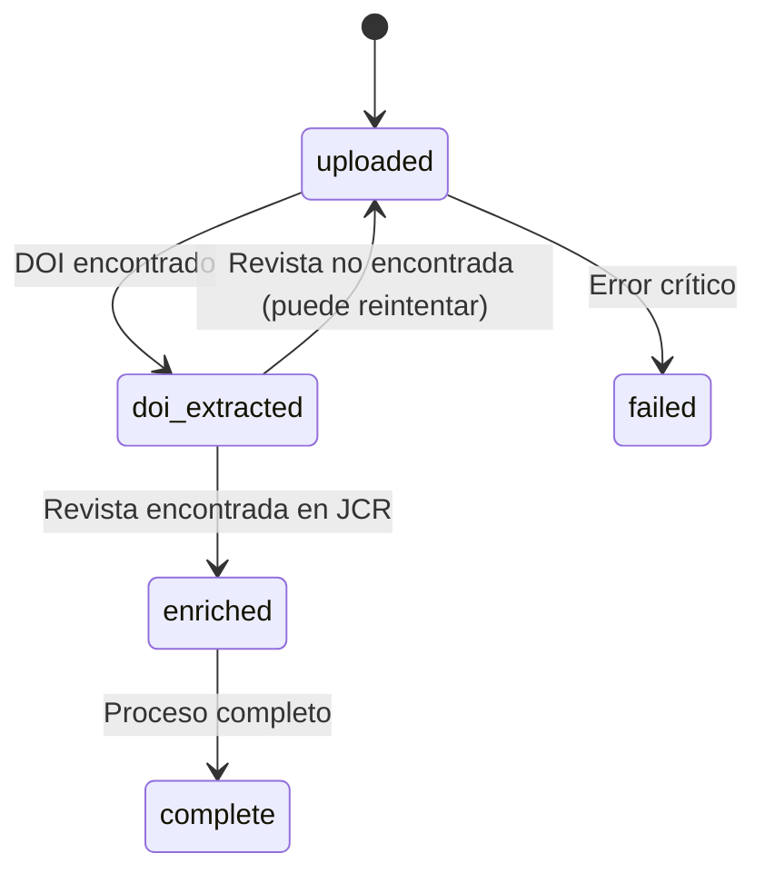
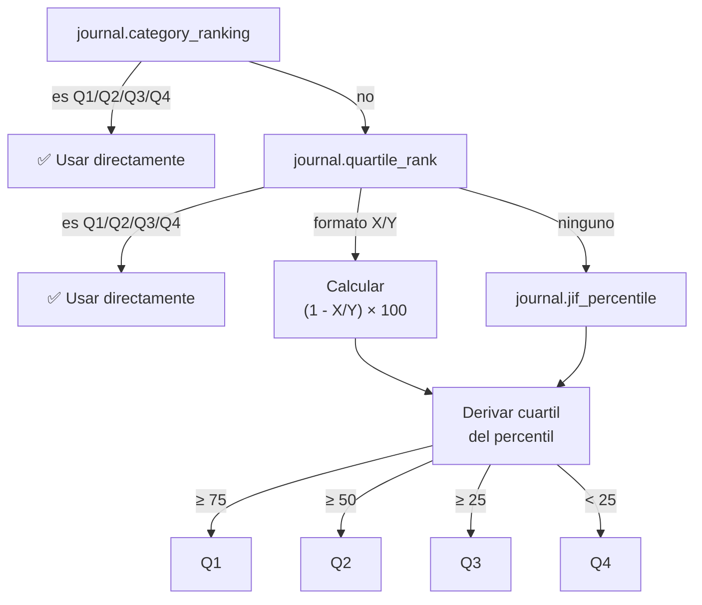

# Base de Datos

Base de datos: **PostgreSQL 15** vía Supabase.

---

## Diagrama ER — Tablas principales

> Versión simplificada con campos más relevantes. Ver secciones siguientes para el detalle completo de cada tabla.

---

## Tabla: `journals`

> 35.000+ registros importados desde JCR (Journal Citation Reports) Excel.

| Campo | Tipo | Descripción |
|-------|------|-------------|
| `id` | int PK | Identificador |
| `issn` | varchar(20) | ISSN impreso (ej: `1234-5678`) |
| `eissn` | varchar(20) | ISSN electrónico |
| `title` | varchar(500) | Título completo de la revista |
| `title_abbrev` | varchar(200) | Abreviatura de título |
| `iso_abbrev` | varchar(200) | Abreviatura ISO |
| `year` | int | Año del dataset JCR |
| `impact_factor` | float | JIF del año |
| `impact_factor_5yr` | float | JIF a 5 años |
| `eigenfactor` | float | EigenFactor Score |
| `article_influence` | float | Article Influence Score |
| `immediacy_index` | float | Immediacy Index |
| `norm_eigenfactor` | float | Normalized EigenFactor |
| `quartile_rank` | varchar(20) | "Q1", "Q2" o posición "15/250" |
| `jif_percentile` | float | Percentil JIF (0–100) |
| `category_ranking` | varchar(500) | Ranking por categoría |
| `categories_code` | text | Códigos de categorías JCR |
| `categories_description` | text | Descripción de categorías |
| `edition` | varchar(100) | "SCIE", "SSCI", "ESCI" |
| `publisher_name` | varchar(500) | Nombre del editor |
| `country` | varchar(200) | País del editor |
| `address` | text | Dirección del editor |
| `total_cites` | int | Total de citas |
| `cited_half_life` | float | Vida media de citas |
| `created_at` | datetime | Fecha de inserción |

**Índices:** `issn`, `eissn`

---

## Tabla: `publications`

> Publicaciones subidas por usuarios con DOI extraído y métricas JCR vinculadas.

| Campo | Tipo | Descripción |
|-------|------|-------------|
| `id` | int PK | Identificador |
| `title` | varchar(1000) | Título del paper |
| `doi` | varchar(300) | DOI único (ej: `10.1000/xyz`) |
| `abstract` | text | Resumen |
| `year` | int | Año de publicación |
| `volume` | int | Volumen |
| `issue` | int | Número |
| `pages` | varchar(50) | Páginas (ej: "100-115") |
| `pdf_filename` | varchar(500) | Nombre original del PDF |
| `pdf_storage_path` | varchar(1000) | Path en Supabase Storage |
| `journal_id` | int FK → journals | Revista vinculada (nullable) |
| `journal_issn_raw` | varchar(50) | ISSN detectado antes de vincular |
| `impact_factor_snapshot` | float | IF al momento del upload |
| `quartile_snapshot` | varchar(10) | "Q1"–"Q4" al momento del upload |
| `jif_percentile_snapshot` | float | Percentil JIF al momento del upload |
| `status` | varchar(50) | Estado del procesamiento |
| `doi_extraction_method` | varchar(50) | Método de extracción |
| `openalex_data` | text | JSON raw de OpenAlex |
| `created_at` | datetime | Fecha de subida |
| `updated_at` | datetime | Última modificación |

**Status posibles:**

---

## Tabla: `scientific_projects`

| Campo | Tipo | Descripción |
|-------|------|-------------|
| `id` | int PK | |
| `title` | text | Nombre del proyecto |
| `code` | varchar | Código (ej: "CEP001") |
| `work_package` | varchar | Work Package WP1-WPn |
| `grant_type` | varchar | Tipo de financiamiento |
| `pi_id` | int FK → academic_members | Investigador principal |
| `pi_name` | varchar | Nombre PI (desnormalizado) |
| `start_date` | date | Fecha inicio |
| `end_date` | date | Fecha fin |
| `status` | varchar | Activo / Finalizado / En pausa / Pendiente |
| `progress` | float | Progreso global (0–100) |
| `budget_allocated` | float | Presupuesto asignado |
| `budget_executed` | float | Presupuesto ejecutado |
| `currency` | varchar(10) | "CLP", "USD", etc. |
| `years_covered` | int[] | Años cubiertos |
| `color` | varchar(20) | Color hex para Gantt |
| `notes` | text | Notas adicionales |
| `created_at` | datetime | |
| `updated_at` | datetime | |

---

## Tabla: `project_activities`

> Las fechas se almacenan como meses relativos al inicio del proyecto, no como fechas absolutas.

| Campo | Tipo | Descripción |
|-------|------|-------------|
| `id` | int PK | |
| `project_id` | int FK → scientific_projects | |
| `number` | int | Número de actividad (D1, D2…) |
| `description` | text | Descripción de la actividad |
| `start_month` | int | Mes inicio relativo al proyecto (1-based) |
| `end_month` | int | Mes fin relativo al proyecto |
| `status` | varchar | pending / in_progress / done / blocked |
| `progress` | int | Porcentaje (0–100) |
| `budget_allocated` | float | Presupuesto asignado |
| `payment_status` | varchar | pendiente / pagado / parcial |
| `payment_proof_url` | text | URL del comprobante |
| `sort_order` | int | Orden visual en Gantt |
| `notes` | text | |
| `created_at` | datetime | |

**Estados de actividad:**

| Status | Color en Gantt |
|--------|---------------|
| `pending` | Gris `#94a3b8` |
| `in_progress` | Azul `#3b82f6` |
| `done` | Verde `#22c55e` |
| `blocked` | Rojo `#ef4444` |

---

## Tabla: `task_dependencies`

| Campo | Tipo | Descripción |
|-------|------|-------------|
| `id` | int PK | |
| `source` | int FK → project_activities | Actividad origen |
| `target` | int FK → project_activities | Actividad destino |
| `type` | varchar | "0"=FS, "1"=SS, "2"=FF, "3"=SF |

> Tipos de dependencia: **FS** (Finish-to-Start), **SS** (Start-to-Start), **FF** (Finish-to-Finish), **SF** (Start-to-Finish)

---

## Tabla: `academic_members`

| Campo | Tipo | Descripción |
|-------|------|-------------|
| `id` | int PK | |
| `full_name` | varchar | Nombre completo |
| `email` | varchar | Email institucional |
| `rut` | varchar | RUT (Chile) |
| `institution` | varchar | Universidad / institución |
| `member_type` | varchar | "researcher" / "staff" / "pi" |
| `wp_id` | varchar | Work Package asignado |
| `is_active` | bool | Miembro activo |
| `created_at` | datetime | |

---

## Tabla: `researcher_details`

> Datos bibliométricos de investigadores (1:1 con academic_members).

| Campo | Tipo | Descripción |
|-------|------|-------------|
| `id` | int PK | |
| `member_id` | int FK → academic_members | |
| `first_name` | varchar | |
| `last_name` | varchar | |
| `orcid` | varchar | ORCID iD |
| `category` | varchar | Categoría académica |
| `citaciones_totales` | int | Total de citas |
| `indice_h` | int | Índice H |
| `works_count` | int | Número de publicaciones |
| `i10_index` | int | Índice i10 |
| `url_foto` | text | URL de foto de perfil |
| `start_date` | date | Ingreso al centro |
| `end_date` | date | Salida del centro |

---

## Tabla: `responsibility_assignments`

> Matriz RACI: quién es Responsible, Accountable, Consulted, Informed por actividad.

| Campo | Tipo | Descripción |
|-------|------|-------------|
| `id` | int PK | |
| `resource_type` | varchar | "activity" / "project" |
| `resource_id` | int | ID de la actividad o proyecto |
| `raci_role` | char(1) | "R" / "A" / "C" / "I" |
| `member_id` | int FK → academic_members | |
| `created_at` | datetime | |
| `created_by` | int | ID del usuario que asignó |

---

## Lógica de derivación de cuartil

El cuartil no siempre viene explícito en JCR. El servicio `journal_service.py` lo deriva en este orden de prioridad:

