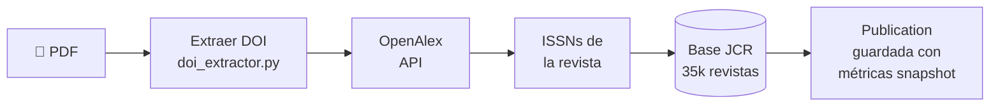

# Flujo de Upload

> Este documento está integrado en [flujos.md](./flujos.md) con mayor detalle.
> Ver sección **"1. Flujo: Upload PDF → Enriquecimiento JCR"**.

## Resumen rápido

## Servicios involucrados

| Servicio | Archivo | Responsabilidad |
|----------|---------|-----------------|
| `DOIExtractor` | `services/doi_extractor.py` | Extrae DOI desde bytes PDF |
| `OpenAlexService` | `services/openalex_service.py` | Consulta metadata por DOI |
| `JournalService` | `services/journal_service.py` | Busca revista en JCR + calcula métricas |

## Estrategias de extracción de DOI

1. **Metadata del PDF** — campo `doi`, `Subject` o `Keywords`
2. **Regex en texto** — patrón `10\.\d{4,9}/[-._;()/:a-zA-Z0-9]+` en primeras 3 páginas
3. **Manual** — el usuario ingresa el DOI en el frontend

## Fallback de búsqueda de revista

1. Por ISSN (normalizado a `XXXX-XXXX`)
2. Por título + publisher
3. Por título solo (case-insensitive)
