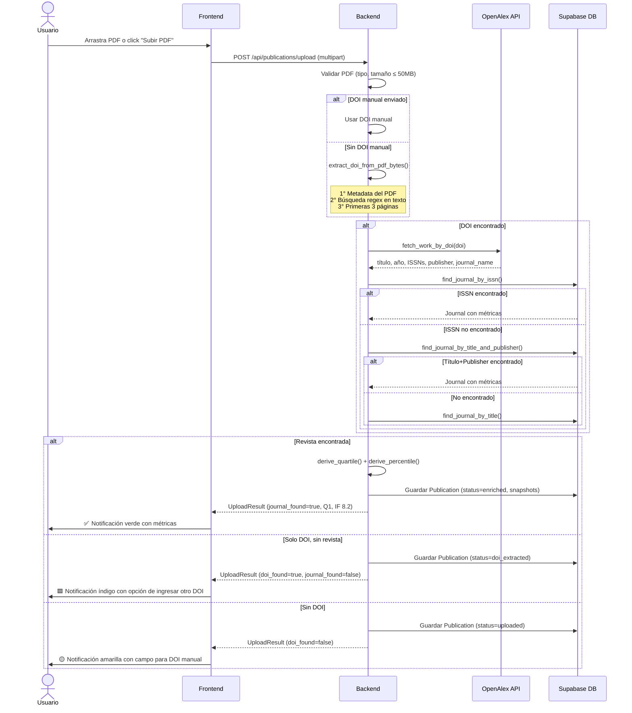
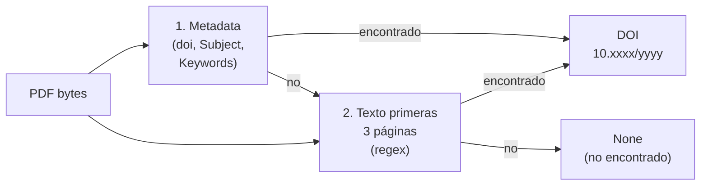
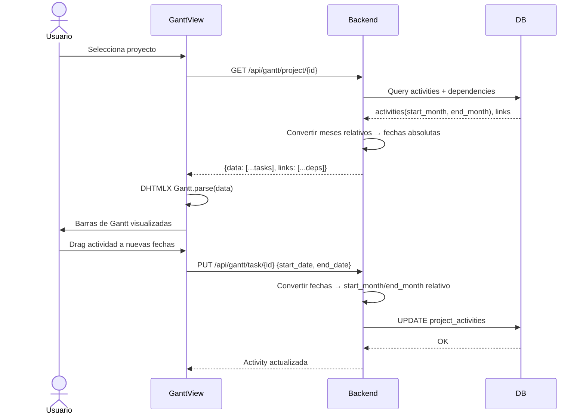
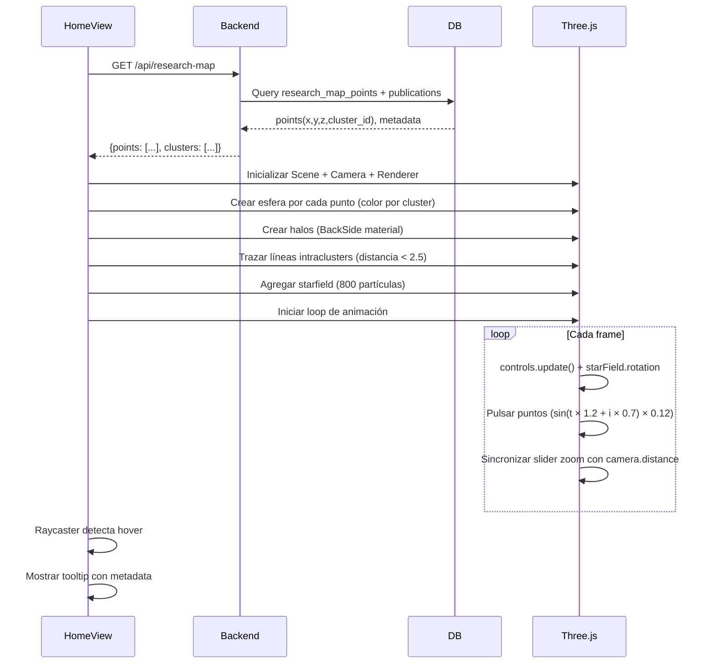
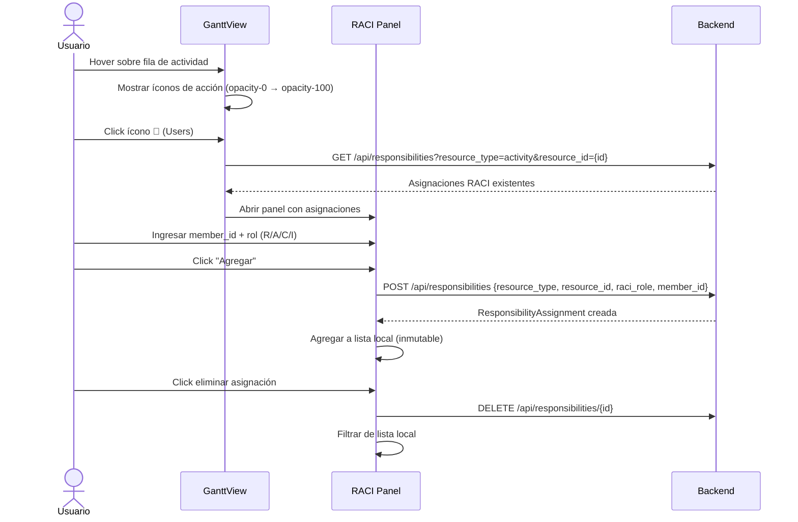
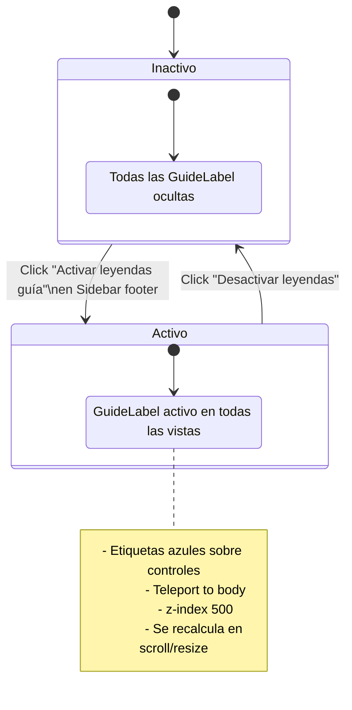
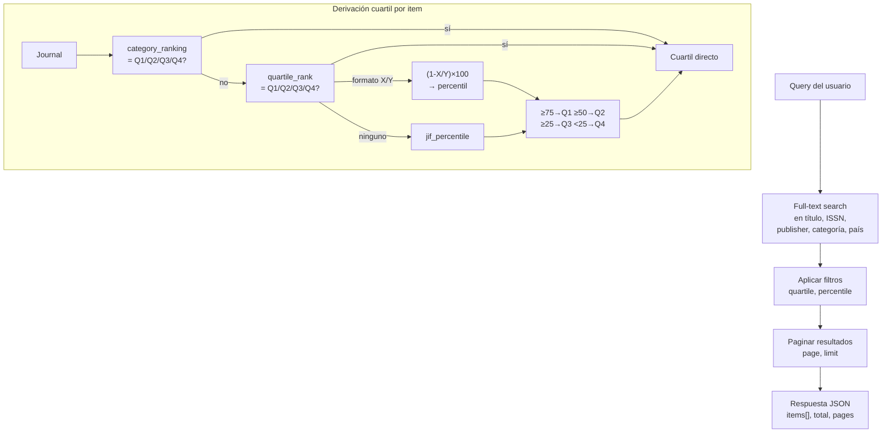

# Flujos Principales

---

## 1. Flujo: Upload PDF → Enriquecimiento JCR

El flujo más importante del sistema. Un PDF se convierte en una publicación con métricas JCR.



### Estados posibles del resultado

| Color UI | Condición | Qué ver |
|----------|-----------|---------|
| 🟢 Verde | `journal_found=true` | Cuartil, IF, Percentil |
| 🟦 Índigo | `doi_found=true`, `journal_found=false` | DOI encontrado pero revista no en JCR |
| 🟡 Amarillo | `doi_found=false` | Sin DOI en PDF |
| 🔴 Rojo | `state=error` | Error de red o del servidor |

### Extracción de DOI



---

## 2. Flujo: Gantt — Proyectos y Actividades



### Conversión de meses relativos a fechas

```
project.start_date = 2026-01-01
activity.start_month = 3   →   start_date = 2026-03-01
activity.end_month   = 6   →   end_date   = 2026-06-30
```

Esta estrategia permite mover las fechas del proyecto sin tener que actualizar cada actividad individualmente.

---

## 3. Flujo: Mapa 3D de Publicaciones



---

## 4. Flujo: RACI — Asignación de Responsabilidades



---

## 5. Flujo: Modo Leyendas Guía



**El estado NO persiste entre sesiones** — se resetea al recargar la página (comportamiento intencional).

---

## 6. Flujo: Búsqueda de Revistas JCR


