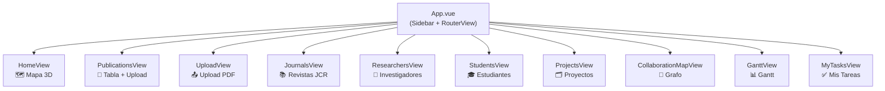

# Frontend — Arquitectura y Componentes

**Stack:** Vue 3 · Vite · TypeScript · Tailwind CSS 4 · Pinia · lucide-vue-next

**Convención universal:** Composition API con `<script setup lang="ts">` en todos los SFCs.

---

## Router — Vistas disponibles

| Ruta | Nombre | Vista | Descripción |
|------|--------|-------|-------------|
| `/` | home | `HomeView` | Mapa 3D de publicaciones (Three.js) |
| `/publications` | publications | `PublicationsView` | Tabla + upload drag & drop |
| `/upload` | upload | `UploadView` | Upload dedicado de PDFs |
| `/journals` | journals | `JournalsView` | Búsqueda de revistas JCR |
| `/researchers` | researchers | `ResearchersView` | Tabla de investigadores |
| `/students` | students | `StudentsView` | Tabla de estudiantes |
| `/projects` | projects | `ProjectsView` | Tabla de proyectos científicos |
| `/collaboration-map` | collaboration-map | `CollaborationMapView` | Grafo de colaboración |
| `/gantt` | gantt | `GanttView` | Planificación con DHTMLX Gantt |
| `/my-tasks` | my-tasks | `MyTasksView` | Mis tareas con asignaciones RACI |

---

## Diagrama de vistas



---

## Vistas en detalle

### HomeView — Mapa 3D (Three.js)

Visualización interactiva 3D de publicaciones agrupadas por cluster temático.

**Tecnologías:** Three.js + OrbitControls + Raycaster

**Características:**
- Esfera por cada publicación (posición x/y/z desde BD)
- Color por cluster (5 colores disponibles)
- Halo suave en cada punto (BackSide SphereGeometry)
- Líneas de conexión intraclusters (distancia < 2.5)
- Starfield de fondo (800 partículas)
- Hover → tooltip con título, año, cuartil, DOI
- Click en leyenda → toggle visibilidad del cluster
- Slider de zoom + `OrbitControls` (arrastra para rotar, scroll para zoom)
- Se recalcula al cambiar tamaño de ventana

**Estado local:**
```typescript
points: MapPoint[]       // datos del endpoint
clusters: Cluster[]      // grupos con colores
hovered: MapPoint | null // punto bajo el cursor
visibleClusters: Set<number>
zoomPct: number          // 0–100
```

---

### PublicationsView — Tabla + Drag & Drop

Vista principal de gestión de publicaciones.

**Características:**
- Drag & drop de PDFs sobre toda la página
- Botón "Subir PDF" (file input oculto)
- Botón "Ingresar DOI" (abre ManualDoiModal)
- Notificaciones de upload con auto-dismiss (4s éxito, 5s error)
- Búsqueda full-text (título, DOI, revista)
- Filtros: año, cuartil
- Sorting por columna (título, año, cuartil, IF) con indicador de dirección
- Indicador "★ Top 10%" cuando `jif_percentile_snapshot ≥ 90`
- Botón eliminar con spinner durante la operación
- Reintento con DOI manual cuando la revista no se encontró

**Columnas de la tabla:**

| Columna | Sorteable | Descripción |
|---------|-----------|-------------|
| Título | ✅ | Título truncado con tooltip |
| Año | ✅ | Año de publicación |
| Revista | ❌ | Nombre de revista vinculada |
| Cuartil | ✅ | Badge de color (Q1–Q4) |
| IF | ✅ | Impact Factor con 2 decimales |
| DOI | ❌ | Enlace externo |
| Estado | ❌ | Badge de estado del procesamiento |
| Acciones | ❌ | Botón eliminar con AppTooltip |

---

### GanttView — Planificación de Proyectos

Vista dual de planificación.

**Tab "Por Proyecto":**
- Selector de proyecto (dropdown)
- DHMLXGantt: barras de actividades con drag & drop
- Dependencias visuales entre actividades
- Click en barra → ActivityStatusModal
- Botones expandir/contraer todo
- Formulario inline para nueva actividad

**Tab "Vista Global":**
- ProjectsGantt: todos los proyectos en línea de tiempo
- Agrupado por año
- Botones expandir/contraer proyectos

**Estados de actividad con colores:**

| Estado | Color |
|--------|-------|
| `pending` | Gris |
| `in_progress` | Azul |
| `done` | Verde |
| `blocked` | Rojo |

---

## Componentes reutilizables

### UI

#### `GuideLabel.vue`

Etiqueta flotante contextual del modo "Leyendas Guía". Usa `Teleport to="body"` y `position: fixed` calculado con `getBoundingClientRect()` para evitar problemas de z-index y overflow.

```vue
<GuideLabel text="Elige el proyecto para ver su Gantt" position="top">
  <select v-model="selectedProjectId">...</select>
</GuideLabel>
```

**Props:**

| Prop | Tipo | Default | Descripción |
|------|------|---------|-------------|
| `text` | string | — | Texto descriptivo |
| `position` | `top\|bottom\|left\|right` | `bottom` | Posición relativa al elemento |

**Solo visible cuando `guideStore.active === true`.**

---

#### `AppTooltip.vue`

Tooltip hover para botones icon-only. Se oculta automáticamente en `mousedown` para no solaparse con modales o acciones.

```vue
<AppTooltip text="Eliminar publicación" position="left">
  <button @click="deletePublication(id)">
    <Trash2 class="w-4 h-4" />
  </button>
</AppTooltip>
```

**Props:** `text`, `position` (igual que GuideLabel)

**Comportamiento:**
- `mouseenter` → muestra con delay de 400ms
- `mouseleave` → oculta inmediatamente
- `mousedown` → oculta inmediatamente (evita solapamiento)

---

### Proyectos

#### `DHMLXGantt.vue`

Wrapper del componente DHTMLX Gantt. Recibe actividades del padre y expone métodos para control externo.

**Métodos expuestos:**
```typescript
ganttRef.expandAll()       // expande todas las filas
ganttRef.collapseAll()     // colapsa todas las filas
ganttRef.reload()          // recarga datos desde el servidor
```

#### `ActivityStatusModal.vue`

Modal para actualizar estado, progreso, presupuesto y pago de una actividad.

**Emits:** `save(status, progress, budget, paymentStatus)`, `close`

#### `ProjectsGantt.vue`

Vista global de todos los proyectos en una línea de tiempo horizontal.

**Métodos expuestos:**
```typescript
globalGanttRef.expandAllProjects()
globalGanttRef.collapseAllProjects()
```

---

### Publicaciones

#### `ManualDoiModal.vue`

Modal para ingresar un DOI manualmente y asociarlo a una publicación nueva o existente.

**Emits:** `done(UploadResult)`, `close`

---

## Stores (Pinia)

### `guide.ts` — Modo Leyendas Guía

```typescript
const guideStore = useGuideStore()

guideStore.active   // boolean
guideStore.toggle() // activa/desactiva
```

Controla la visibilidad global de todos los `GuideLabel`. El estado **no persiste** entre sesiones (intencional — se resetea al recargar).

---

## Tipos TypeScript principales

```typescript
// Revista JCR
interface Journal {
  id: number
  issn: string | null
  eissn: string | null
  title: string
  impact_factor: number | null
  jif_percentile: number | null
  quartile_rank: string | null
  categories_description: string | null
  publisher_name: string | null
  country: string | null
}

// Publicación con métricas snapshotadas
interface Publication {
  id: number
  title: string | null
  doi: string | null
  year: number | null
  status: 'uploaded' | 'doi_extracted' | 'enriched' | 'complete' | 'failed'
  impact_factor_snapshot: number | null
  quartile_snapshot: string | null
  jif_percentile_snapshot: number | null
  is_top10: boolean
  journal: Journal | null
}

// Proyecto científico
interface ScientificProject {
  id: number
  title: string
  code: string
  status: string
  pi_name: string
  start_date: string
  end_date: string
  progress: number
  budget_allocated: number | null
  budget_executed: number | null
  currency: string | null
  color: string | null
}

// Actividad de proyecto (Gantt)
interface ProjectActivity {
  id: number
  project_id: number
  description: string
  start_month: number
  end_month: number
  status: 'pending' | 'in_progress' | 'done' | 'blocked'
  progress: number
  start_date: string  // calculado
  end_date: string    // calculado
}

// Asignación RACI
interface ResponsibilityAssignment {
  id: number
  raci_role: 'R' | 'A' | 'C' | 'I'
  member_id: number
  member_name: string | null
}
```

**Colores de cuartil:**
```typescript
const QUARTILE_COLORS: Record<string, string> = {
  Q1: 'bg-green-100 text-green-800',
  Q2: 'bg-blue-100 text-blue-800',
  Q3: 'bg-yellow-100 text-yellow-800',
  Q4: 'bg-red-100 text-red-800',
}
```

---

## Servicio API (`api.ts`)

Cliente axios centralizado con base URL configurable por entorno.

```typescript
// Publicaciones
publicationsApi.getAll()
publicationsApi.uploadPdf(file, manualDoi?)
publicationsApi.uploadWithDoi(doi)
publicationsApi.enrichWithDoi(id, doi)
publicationsApi.delete(id)

// Revistas JCR
journalsApi.search({ q, quartile, min_percentile, max_percentile, page, limit })

// Investigadores / Estudiantes / Proyectos
researchersApi.search({ q, member_type, page, limit })
studentsApi.search({ q, status, program, page, limit })
projectsApi.search({ q, status, page, limit })

// Actividades y RACI
projectActivitiesApi.list(projectId)
projectActivitiesApi.create(payload)
projectActivitiesApi.update(id, payload)
projectActivitiesApi.delete(id)

responsibilitiesApi.list(resourceType, resourceId)
responsibilitiesApi.create(payload)
responsibilitiesApi.delete(id)
responsibilitiesApi.myTasks(memberId?)
responsibilitiesApi.myTasksMembers()
```

---

## Convenciones de código

```typescript
// ✅ Correcto — import de tipo
import type { Publication } from '@/types/publication'

// ❌ Incorrecto — puede causar runtime crash con Vite
import { Publication } from '@/types/publication'

// ✅ Computed para valores derivados
const filtered = computed(() => publications.value.filter(...))

// ✅ watch para efectos secundarios
watch(selectedProjectId, loadActivities)

// ✅ Props tipadas explícitamente
const props = withDefaults(defineProps<{ text: string }>(), { text: '' })
```
