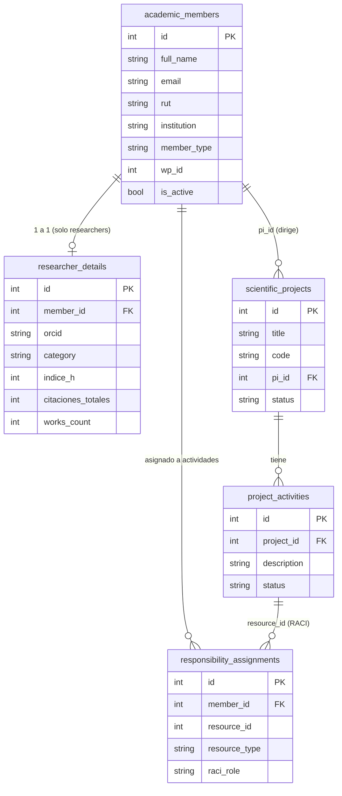
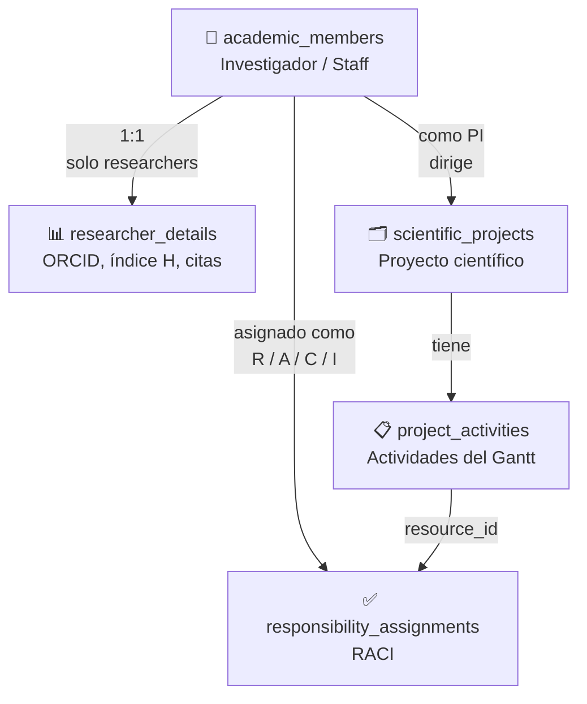

# Usuarios y Miembros del Sistema

> **Nota:** Los "usuarios" en CECAN son **miembros académicos** registrados en la tabla `academic_members`.
> El sistema de autenticación JWT está preparado en el backend pero **aún no está activado** —
> actualmente no hay login ni contraseñas. Todos los endpoints son públicos.

---

## Miembros de prueba (seed)

Creados por `scripts/seed_users.py`. Son idempotentes (no duplican si el email ya existe).

### Investigadores

| ID | Nombre | Email | Institución | WP | ORCID |
|----|--------|-------|-------------|-----|-------|
| — | Dra. María González Reyes | `m.gonzalez@cecan.cl` | Universidad de Chile | WP1 | `0000-0001-2345-6789` |
| — | Dr. Carlos Mendoza Fuentes | `c.mendoza@cecan.cl` | P. Universidad Católica | WP2 | `0000-0002-3456-7890` |
| — | Dra. Valentina Rojas Castro | `v.rojas@cecan.cl` | Universidad de Concepción | WP3 | `0000-0003-4567-8901` |
| — | Dr. Andrés Herrera Lagos | `a.herrera@cecan.cl` | Universidad de Santiago | WP4 | `0000-0004-5678-9012` |

### Staff

| Nombre | Email | Institución |
|--------|-------|-------------|
| Felipe Soto Vargas | `f.soto@cecan.cl` | CECAN |

> **Contraseñas:** No aplica. Estos registros son datos académicos, no cuentas de acceso.
> Cuando se implemente auth, las credenciales se gestionarán por separado (Supabase Auth o JWT propio).

---

## Relaciones entre entidades



---

## Cómo se relacionan



### En palabras simples

1. **Un `academic_member`** puede ser investigador (`researcher`) o staff.
2. **Los investigadores** tienen un registro adicional en `researcher_details` con métricas bibliométricas (ORCID, índice H, citas).
3. **Un investigador puede ser PI** (Principal Investigator) de uno o más proyectos — referenciado por `scientific_projects.pi_id`.
4. **Los proyectos tienen actividades** (`project_activities`) que forman el Gantt.
5. **Las actividades tienen asignaciones RACI** (`responsibility_assignments`) que vinculan miembros con roles R/A/C/I.
6. **Mis Tareas** (`/my-tasks`) muestra todas las actividades donde un miembro tiene cualquier rol RACI.

---

## Tipos de miembro

| `member_type` | Descripción | Tiene `researcher_details` |
|---------------|-------------|--------------------------|
| `researcher` | Investigador académico | ✅ Sí |
| `staff` | Personal administrativo / apoyo | ❌ No |
| `pi` | Investigador Principal (puede usarse como alias) | ✅ Sí |

---

## Roles RACI

| Rol | Letra | Descripción |
|-----|-------|-------------|
| **Responsible** | `R` | Quien ejecuta la tarea |
| **Accountable** | `A` | Quien responde por el resultado final |
| **Consulted** | `C` | Quien aporta expertise o input |
| **Informed** | `I` | Quien recibe actualizaciones del avance |

Una actividad puede tener múltiples miembros con distintos roles.

---

## Ejecutar el seed

```bash
cd /ruta/al/proyecto
python scripts/seed_users.py
```

El script es **idempotente** — si un email ya existe, lo omite sin error.

---

## Cuando se implemente autenticación

El plan previsto es usar **Supabase Auth** o el sistema JWT propio del backend (`SECRET_KEY`, `ALGORITHM`, `ACCESS_TOKEN_EXPIRE_MINUTES` ya están configurados). Las cuentas de acceso serán independientes de `academic_members` y se vincularán por email.
