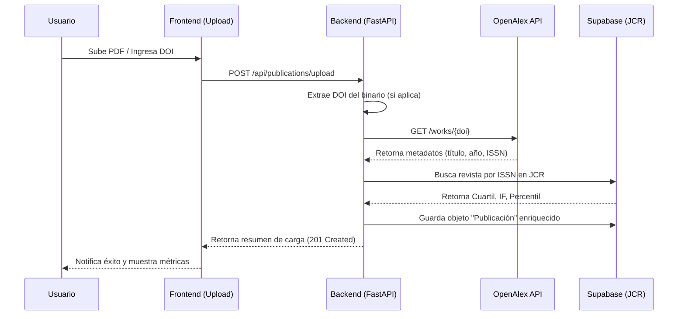

# Flujos de Trabajo — CECAN Platform

## 1. Ciclo de Vida de una Publicación
El proceso de ingesta está diseñado para ser resiliente y enriquecer los datos automáticamente.

---

## 2. Gestión de Proyectos e Hitos (Gantt)
El flujo operacional para el cumplimiento de metas ANID.

1.  **Definición de Proyecto:** Creación del cronograma en `/gantt`.
2.  **Seguimiento Dinámico:** Los administradores actualizan el estado de las tareas (To Do / In Progress / Done).
3.  **Visualización:** El progreso se refleja instantáneamente en la vista Gantt global para la toma de decisiones.

---

## 3. Visualización 3D y Navegación Espacial
1.  **Cálculo de Proximidad:** Basado en la frecuencia de co-autoría y temas comunes.
2.  **Renderizado interactivo:** El motor Force-Graph 3D renderiza nodos (investigadores) y aristas (colaboraciones).
3.  **Navegación:** El usuario puede orbitar la red y hacer zoom en clústeres temáticos para identificar nichos de impacto.
